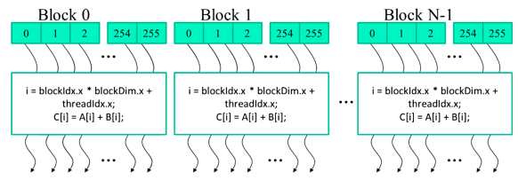

= Introduction to programming general purpose GPU accelerated applications utilizing CUDA
Felix Kunaver
:toc:
:sectnums: |,all|
:source-highlighter: coderay

== Introduction
=== Why?
The architecture of GPUs allow for a very different computational workload compared to CPUs. CPUs were originally  modeled  to consist of only one core which computes things in a linear fashion... TODO. Nowadays, due to a slow down in single core performance, most CPU manufacturers aare releasing CPUs with multiple cores, the number of these cores are still not in any way comparable to those of GPUs. TODO

TODO

GPUs are utilized in a variety of well known workloads, among others:

- Machine Learning (Neural Networks)
- Rendering Engines & Image Processing 
- Simulation Software (Fluid, Medical, Financial, Weather, etc.)
- Crypto Mining (Computation of Cryptographic Hashes)

TODO Basically any computation which can be represented well in the format of matrices and matrix-computations can usually be implemented efficiently utilizing GPU hardware. 

=== GPU architecture 
.Simplified comparison of CPU vs GPU architecture, NVIDIA, CC BY 3.0 <https://creativecommons.org/licenses/by/3.0>, via Wikimedia Commons
image::https://upload.wikimedia.org/wikipedia/commons/c/c6/Cpu-gpu.svg[GPU vs CPU]

CPUs typically feature a small number of powerful cores, designed for versatile, single-threaded performance. They excel in handling tasks with intricate branching and diverse instruction sets. In contrast, GPUs comprise a multitude of smaller and simpler cores, emphasizing parallel processing. Their architecture, with shallow instruction pipelines, enables the execution of the same instructions across multiple data points simultaneously, called Single Instruction Multiple Data (SIMD)footnote:[Cuda utilizes the paradigm of Single Program Multiple Data (SPMD), the main difference being that not the exact same instruction has to be executed in each thread, but the same program, this allows for branching and more.], making GPUs highly efficient for data-parallel workloads.

Memory hierarchy is another differentiating factor. CPUs incorporate a complex hierarchy with various levels of cache to minimize memory access latency. This design suits low-latency tasks and diverse data types. GPUs, on the other hand, prioritize high memory bandwidth over complex hierarchies, which makes them ideal for data-intensive parallel processing but less effective for latency-sensitive tasks. 

=== Prerequisites
To run the executables provided in the repository you will need a device which has an Nvidia GPU and also somewhat recent Nvidia drivers installed. 

If you want to run the provided code directly or modify it you will also need to install the Nvidia CUDA Developer Toolkit Version 12.2, found on the Nvidia website. The toolkit also seamlessly integrates into Microsoft Visual Studio 2022/2019 so using this IDE is  recommended. 

== Your first CUDA program 

=== The Task

For this example we will be looking at the simple task of vector addition, where every nth element of vector A and B are added together to result in vector C. First we need to create the two vectors, fill them, and then perform the calculation. The c++ code, that simply, in a linear fashion, loops through the vectors and adds them would look something like this:

[, cpp]
----
include::FirstSteps\CppHelloWorld\CppHelloWorld\CppHelloWorld.cpp[indent = 1]
----

=== CUDA Implementation

For the CUDA implementation we will just be changing the vecAdd() function, adding a further kernel function and adding a few includes, the rest of the code will remain the same and will not be shown again.

[, cpp]
----
include::FirstSteps\CudaHelloWorld\CudaHelloWorld\kernel.cu[tags=imports]
----

==== Cuda Memory

For better understanding we will be labeling our variables from here on with the prefixes h_ and d_ to differentiate between variables stored on host memory and variables stored on GPU/device memory. 

Until now in our c++ implementation we have just had to handle memory in our RAM. The GPU however can during computation only access the memory which is on the device itself, so previous to computation we will have to handle getting it onto the device. This is achieved through two functions: cudaMalloc and cudaMemcpy. 

[, cpp]
----
include::FirstSteps\CudaHelloWorld\CudaHelloWorld\kernel.cu[tags=memory]
----

cudaMalloc is very similar to the normal malloc function. It is used to first allocate space on the GPU for us to later place data into. It takes two inputs, first a pointer to a pointer is provided, which after execution of the function will be set to the location in memory that was allocated, second the size in bytes we need to allocate. 

Following this we can call cudaMemcpy to take the previously allocated space and write the data into it. It takes 4 inputs: the pointer from cudaMalloc which points the the allocated memory, the pointer to the data we want to copy from the host, the size of the data we are copying, and finally the type of copy operation eg. if from host to device, device to host, host to host, or device to device. 

And at the end of our vecAdd() function we will need to copy the result back to the host and free the memory we previously claimed on the GPU using cudaFree(), passing in the pointer to the device memory we want to free up:

[, cpp]
----
include::FirstSteps\CudaHelloWorld\CudaHelloWorld\kernel.cu[tags=memoryback]
----

==== CUDA Kernel

The CUDA kernel is where we actually define the operations we want to perform on our data. So in our case the simple addition of two vector elements.

CUDA execution is organized into a hierarchical structure of so called Grids, Blocks and Threads. Threads are the smallest unit of execution the GPU is capable of. In the end each thread is responsible for a small part of the larger task. Multiple threads are organized to be part of a block. Within this block threads can cooperate through shared memory and synchronization. Finally the blocks are organized into grids, within the grid, blocks operate independently and in parallel, they also do not share memory or communicate. One more complex features this architecture enables is the fact that it allows us to more easily handle data which has a 2d structure(eg. images, matrices) or 3d structure(eg. volumetric computation, video rendering), but more on that later in the paper.

.Structure of Blocks and their Threads, source: Programming Massively Parallel Processors

We can now define our CUDA kernel by using the \\__global__ tag. This designates it as being executed on our GPU device, but only as callable from our host, alternatives are \\__device__ for kernels only called by the device to be run on the device, and \\__host__ for CUDA functions called by the host to be run on the host.

[, cpp]
----
include::FirstSteps\CudaHelloWorld\CudaHelloWorld\kernel.cu[tags=kernel]
----

Due to the previously explained block/thread architecture the individual thread has to somehow know what part of the data it is responsible for doing work on, in our case  which nth elements in the vectors to add. This is done through block and thread Ids. Each block is given an Id starting at 0 and each thread contained in this block is given its own Id. Through the use of these two Ids and the block-dimension we can then calculate which part of the data the thread is now responsible for and assign it to the variable i. Note that i is private for each individual thread. Also note that these Ids also exist for the second and third dimension.

[, cpp]
----
include::FirstSteps\CudaHelloWorld\CudaHelloWorld\kernel.cu[tags=callVec]
----

Having now defined our kernel we can now complete our vecAdd() function by calling it. We pass in two parameters, the first being how many blocks we want to create, and secondly we pass in the number of threads we want per blockfootnote:[This factor depends on the algorithm one is running. Depending on the amount of shared memory, registries and communication the individual threads need, the amount should be higher or lower. Most modern Nvidia GPUs allow for up to 1024-4096 maximum threads per block.]. And lastly we need to hand in the pointers to the inputs for the function.

We have now completed our first CUDA program and are ready to build and compile.

==== Performance Comparison

Lets us now see if it was even worth it to rewrite our program in CUDA. We expect the CPU to be much faster with smaller vector sizes, given the fact that they are optimized for low latency and also the fact that our CUDA program has some overhead when first copying the data onto the device.

This is however by no means a very rigorous test and is only meant to display TODO

As expected the tests on the two different GPUs I own show that on smaller vector sizes it is much faster to run on the CPU, but that as the amount of data increases the GPU gets better and better.

== Some More Advances Features

=== Multidimensional Execution

As previously mentioned the Grid/Block/Thread hierarchy allows for 

=== Synchronization

=== Another Look At Memory

==== Memory Hierarchy

==== Tiling

==== Other Memory Tricks 

== Common errors

== Next Steps

== Resources
Book
Example programs
docs 