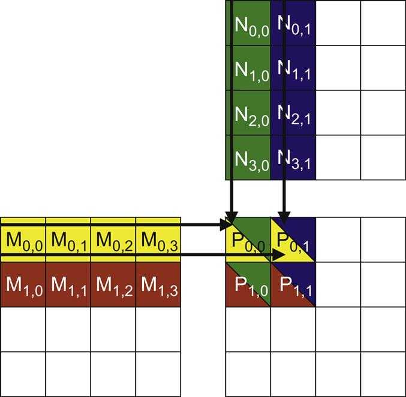

= Introduction to programming general purpose GPU accelerated applications utilizing CUDA in C++
Felix Kunaver
:toc:
:sectnums: |,all|
:source-highlighter: coderay

== Introduction
=== Why?
The architecture of GPUs allow for a very different computational workload compared to CPUs. CPUs were originally  modeled  to consist of only one core which computes things in a linear fashion. Nowadays, due to a slow down in single core performance, most CPU manufacturers are releasing CPUs with multiple cores, however, the number of these cores are still not in any way comparable to those of GPUs. 

GPUs are utilized in a variety of well known workloads, among others:

- Machine Learning (Neural Networks)
- Rendering Engines & Image Processing 
- Simulation Software (Fluid, Medical, Financial, Weather, etc.)
- Crypto Mining (Computation of Cryptographic Hashes)

Basically any computation which can be parallalised well is perfect for GPUs. Memory requirements are also an important factor when considering GPUs, as they are also optimized to have higher memory read speeds than conventional CPUs.

One must however keep in mind that CUDA is a very low level programming interface for GPUs and is therefore usually only used under the hood by libraries offering more higher-level features in a language like python. Before considering writing any CUDA code yourself check if there isnt some kind of library in python or another language that offers you the same capabilities with less effort. If you are interested in graphics rending CUDA could be interesting, but again, CUDA only handels the very low-level computational work, while a graphcis pipeline like OpenGL handels the possibly more intersting higher-level stuff. 

=== GPU architecture 
.Simplified comparison of CPU vs GPU architecture, NVIDIA, CC BY 3.0 <https://creativecommons.org/licenses/by/3.0>, via Wikimedia Commons
image::https://upload.wikimedia.org/wikipedia/commons/c/c6/Cpu-gpu.svg[GPU vs CPU]

CPUs typically feature a small number of powerful cores, designed for versatile, single-threaded performance. They excel in handling tasks with intricate branching and diverse instruction sets. In contrast, GPUs comprise a multitude of smaller and simpler cores, emphasizing parallel processing. Their architecture, with shallow instruction pipelines, enables the execution of the same instructions across multiple data points simultaneously, called Single Instruction Multiple Data (SIMD)footnote:[Cuda utilizes the paradigm of Single Program Multiple Data (SPMD), the main difference being that not the exact same instruction has to be executed in each thread, but the same program, this allows for branching and more.], making GPUs highly efficient for data-parallel workloads.

Memory hierarchy is another differentiating factor. CPUs incorporate a complex hierarchy with various levels of cache to minimize memory access latency. This design suits low-latency tasks and diverse data types. GPUs, on the other hand, prioritize high memory bandwidth over complex hierarchies, which makes them ideal for data-intensive parallel processing but less effective for latency-sensitive tasks. 

=== Prerequisites
To run the executables provided in the repository you will need a device which has an Nvidia GPU and also somewhat recent Nvidia drivers installed. 

If you want to run the provided code directly or modify it you will also need to install the Nvidia CUDA Developer Toolkit Version 12.2, found on the Nvidia website. The toolkit also seamlessly integrates into Microsoft Visual Studio 2022/2019 so using this IDE is  recommended. 

== Your first CUDA program 

=== The Task

For this example we will be looking at the simple task of vector addition, where every nth element of vector A and B are added together to result in vector C. First we need to create the two vectors, fill them, and then perform the calculation. The c++ code, that simply, in a linear fashion, loops through the vectors and adds them would look something like this:

[, cpp]
----
include::FirstSteps\CppHelloWorld\CppHelloWorld\CppHelloWorld.cpp[indent = 1]
----

=== CUDA Implementation

For the CUDA implementation we will just be changing the vecAdd() function, adding a further kernel function and adding a few includes, the rest of the code will remain the same and will not be shown again.

[, cpp]
----
include::FirstSteps\CudaHelloWorld\CudaHelloWorld\kernel.cu[tags=imports]
----

==== Cuda Memory

For better understanding we will be labeling our variables from here on with the prefixes h_ and d_ to differentiate between variables stored on host memory and variables stored on GPU/device memory. 

Until now in our c++ implementation we have just had to handle memory in our RAM. The GPU however can during computation only access the memory which is on the device itself, so previous to computation we will have to handle getting it onto the device. This is achieved through two functions: cudaMalloc and cudaMemcpy. 

[, cpp]
----
include::FirstSteps\CudaHelloWorld\CudaHelloWorld\kernel.cu[tags=memory]
----

cudaMalloc is very similar to the normal malloc function. It is used to first allocate space on the GPU for us to later place data into. It takes two inputs, first a pointer to a pointer is provided, which after execution of the function will be set to the location in memory that was allocated, second the size in bytes we need to allocate. 

Following this we can call cudaMemcpy to take the previously allocated space and write the data into it. It takes 4 inputs: the pointer from cudaMalloc which points the the allocated memory, the pointer to the data we want to copy from the host, the size of the data we are copying, and finally the type of copy operation eg. if from host to device, device to host, host to host, or device to device. 

==== CUDA Kernel

The CUDA kernel is where we actually define the operations we want to perform on our data. So in our case the simple addition of two vector elements.

CUDA execution is organized into a hierarchical structure of so called Grids, Blocks and Threads. Threads are the smallest unit of execution the GPU is capable of. In the end each thread is responsible for a small part of the larger task. Multiple threads are organized to be part of a block. Within this block threads can cooperate through shared memory and synchronization. Finally the blocks are organized into the grid, within the grid blocks operate independently and in parallel, they also do not share memory or communicate. We will look at the more complex features of this architecture later in the paper. 

.Structure of Blocks and their Threads, source: Programming Massively Parallel Processors
image::Images\Threads2.png[]

We can now define our CUDA kernel by using the \\__global__ tag. This designates it as being executed on our GPU device, but only as callable from our host, alternatives are \\__device__ for kernels only called by the device to be run on the device, and \\__host__ for CUDA functions called by the host to be run on the host.

[, cpp]
----
include::FirstSteps\CudaHelloWorld\CudaHelloWorld\kernel.cu[tags=kernel]
----

Due to the previously explained block/thread architecture the individual thread has to somehow know what part of the data it is responsible for doing work on, in our case  which nth elements in the vectors to add. This is done through block and thread Ids. Each block is given an Id starting at 0 and each thread contained in this block is given its own Id. Through the use of these two Ids and the block-dimension we can then calculate which part of the data the thread is now responsible for and assign it to the variable i. Note that i is private for each individual thread. 

[, cpp]
----
include::FirstSteps\CudaHelloWorld\CudaHelloWorld\kernel.cu[tags=callVec]
----

Having now defined our kernel we can now complete our vecAdd() function by calling it. We pass in two parameters, the first being how many blocks we want to create, and secondly we pass in the number of threads we want per blockfootnote:[This factor depends on the algorithm one is running. Depending on the amount of shared memory, registries and communication the individual threads need, the amount should be higher or lower. Most modern Nvidia GPUs allow for up to 1024-4096 maximum threads per block.]. With this we are basically telling the GPU how many parrallel computations we want to perform. And lastly we need to hand in the pointers to the inputs for the function.

And at the end of our vecAdd() function we will need to copy the result back to the host and free the memory we previously claimed on the GPU using cudaFree(), passing in the pointer to the device memory we want to free up:

[, cpp]
----
include::FirstSteps\CudaHelloWorld\CudaHelloWorld\kernel.cu[tags=memoryback]
----

We have now completed our first CUDA program and are ready to build and compile.

== Blocks, Threads & Multidimensional Execution

=== The Concept

You might have noticed that when previously worked with the blocks and threads we used the BlockIdx.x and ThreadIdx.x, does the .x mean there are also .y and .z for more dimensions? Yes! 

Say we want to do some processing on some image, doing some computation on each indevidual pixel. While we could use our previous 1D approach like with the vector CUDA has a much nicer approach for splitting up the workload. 

.Structure of Blocks and their Threads, source: CUDA C Programming Guide www.nvidia.com
image::Images/2DBlocks.png[, width=300]

In the picture above is shown how it would look if you were to creat a grid with block dimensions of 3x2 and thread dimension of 4x3. The brackets for each Block/Thread denote their respective BlockIdx.x and BlockIdx.y. This can be done by calling below code:

[, cpp]
----
dim3 grid(3, 2, 1);
dim3 block(4, 3, 1)
someKernel<<<grid, block>>>(someData);
----

And below is how it would look if we process some small picture, with each thread handeling one pixel. While not displayed in the picture we of course must keep in mind to properly compute the correct indecies of the pixel we are processing like in our program from before using BlockDim.x, but additionally using BlockDim.y.

.Example of how one would assign threads to indeidual pixels of a picture using a 2D Block/Thread setup, source: Felix Kunaver :)
image::Images/PictureExample.png[]

While the absence of this feature would not necessarily keep us from doing any computations on 2D/3D data, it allows for much easier implementation of algorithms and also greatly helps when optimizing our code, say in the context of memory calls, but more on that later in the paper.

I hope the graphics help in understanding the concept of the CUDA hierarchy and how it works in multiple dimensions. While not shown here, the same process/concept works also for the 3rd dimension allowing for processing of volumes, tensors, etc. 

=== Example Of 2D Processing: Matrix Multiplication

https://www.mathsisfun.com/algebra/matrix-multiplying.html[Here] is a quick reminder of how matrix multiplication works.

Matrices are inherently 2D and lend well to a small demonstration of how one can use this CUDA feature. For sake of simplicity we are just going to handel square matrices as input. Say we have two 4x4 input matrices, also resulting in a 4x4 matrix. We can split up this resulting matrix like shown in the picture below with blocks dividing the matrix larger groups and threads handling the individual results. Of course on this small scale of matrix using multiple blocks does not really make sense, but with a rise in matrix size at some point we would have to use such a design. 

.Block/Thread view of a 4x4 result Matrix, source: Programming Massively Parallel Processors
image::Images/MatrixBlocks.png[]

Now with our matrices and our computational setup is 2D, optimally we would also like to access our matrices using a two-dimensional array like InputA[][]. However due to the ANSI C version that CUDA is based on, for this to be possible the array sizes have to be known at compile time. So we will still be handeling our data as a one-dimensional array by "falttening" it as shown in the picture below. So with a 4x4 Matrix if we would have liked to access an element by matrix[2][3], we will be doing it like this: matrix[2 * Width + 3].

.Flattening of 2D array into 1D array, source: Programming Massively Parallel Processors
image::Images/Flat.png[]

We can now define our cuda kernel:

[, cpp]
----
include::MatrixMultiplication\MatrixMultiplication\kernel.cu[tags=kernel]
----

Each thread, responsible for one element of the result matrix, calculates which row and column it is responsible for and then iterates through all elements in the corresponding input matrices and adds the result together. In contrast to the first example, since we are using 2D blocks and threads as shown in the code below. We now utilize not only the x index of our threads and blocks but also the y index.

[, cpp]
----
include::MatrixMultiplication\MatrixMultiplication\kernel.cu[tags=call]
----

The memory handling, eg. allocation, copying and freeing stays the same as in the first example, so it is not shown but can be found in the repository.

== Another Look At Memory

=== Memory Hierarchy

When programming CUDA we always have to keep in mind the hardware architecture our code will be running on. One important aspect of this is the memory design on modern Nvidia CUDA GPUs.

A CUDA GPU has several different types of memory organized into a straightforward hierarchy displayed in the picture below. Knowing where to optimally place ones data can have huge performance implications and is one of the most important topics when looking at optimization.

.Diagram of the CUDA memory hierarchy, source: Programming Massively Parallel Processors
image::Images/Memory.png[, width = 300]

Lets take a look at the roles of the differnt memory types:

* **Registers** are the fastest type of memory found on the GPU. Each thread has its one registers that are private to it. Registers can only hold a small amount of datafootnote:[While we technically dont have a limit of how big the ressgister of a single thread is, due to the usage of SMs (Streaming Processors), it is preferable to keep the ammount of register memory used as low as possivble. For more details of  SMs look at the chapter next steps.]. When we creat a scalar variable inside our kernel function, such as the index in our first example, then these are stored within the threads register.
* **Shared Memory** is accessible by all threads in one block. Access to it is faster than access to the global memory, but slower than to a threads register. Using the \\__shared__ keyword infront of a variable we set in a kernel function makes it accessible to the other threads in the same block. More on the use of this memory in the next chapter on Tiling. 
* **Global Memory** is the memory we can write into using cudaMalloc and cudaMemcp. It is the slowest of the memory types available on the CUDA GPU, but is accessible from all threads and blocks and is the largest. In our programs we will usually load our data in here intially but try and get it closer to the threads and into faster memory as quickly as possible. All non-scalar, eg. array variables, we create in our kernel function are stored here by default. 
* **Constant Memory** is simaialer to global memory, with the difference that it can only store constants. Due to this it has slightly faster read times than the global memory. It is set by declaring a variable outside any function body with the \\__constant__ keyword. 

=== Tiling

With our previous matrix multiplication example we are reading elements from our input matrices multiple times. For example, as shown in the picture below, both thread(0, 0) and thread(0, 1) will read the first row of our A input matrix from global memory. This is inefficiant and is likely to cause memory bandwidth issues. With tiling we will get our threads to cooperate on this reading, and load parts("tiles") of our data into shared local memory for faster overall access.

.Multiple threads reading same data, source: https://nichijou.co/cuda7-tiling/

One factor to look at whether to implement tiling is the ratio of floating point operations to global memory loads for a kernel. Taking a look at our original code as shown below we can see both two read operations to our global memory and 2 floating point operations bringing us to an overall "Compute to Global Memory Access Ratio" (CGAM Ratio) of 1. The lower this ratio the more likely we are to have our performance be memory bound, the higher and we are compute bound. To see where we lie we have to take a look at the hardware we are running our code on, for this example lets look at the top of the line Nvidia H100. It has a global memory bandwidth of 3TB/sec and compute performance of 60Terra floating-point operations per second (FLOPS). Each floating point element we are reading is 4 bytes so we can at maximum compute at 0.75Terra FLOPS because 3TB/4B = 0.75T, and our CGAM Ratio of 1. This is way below what the H100 would be capapble of with its 60Terra FLOPS and we are severly memory bound. If we can get our CGAM Ratio to be higher, meaning more operations per memory load, then we would be able to use more of our compute capabilities. Say with a ratio of 10, we would be able to compute at 7.5Terra FLOPS instead of our original 0.75TFLOPS. 

.Diagram of the CUDA memory hierarchy, source: Felix Kunaver :)
image::Images/RatioMatrix.png[, width = 500]

When tiling we eleviate this issue somewhat by getting rid of duplicate global memory reads by different threads in the same block.

Since for our simplified example we assume the input and output matrices to be of the same size, we can solve this duplicate memory issue by giving each thread first the task to load their respective elements from input into shared memory. Thread(0, 0), computing elemnt (0, 0) in the output matrix loads elemnt (0, 0) from both input A and B, thread(0, 1) does the same with elements (0, 1) and so on. However, since our shared memory is obviously smaller than the global one we will usaually not be able to load all the data into shared memory at once so we only load a smaller chunk aka. "Tile". 

=== Tiling Example: Matrix Multiplication Optimization 

We start off our tiled kernel by declaring our shared memory versions of our input matrices using the \\__shared__ keyword. Note that we can use a two-dimensional array for the shared matrices as the size, eg. the tile size, is known at compile time. One could also modify the program so that the tile size is adjusted based on the provided hardware, then the code would also have to be modified to use our "flattend" array as previously shown. 

[, cpp]
----
include::MatrixMultiplication\MatrixMultiplication\kernel.cu[tags=shared]
----

Next we compute the row and column we are working on. This has to be done since our input is "flattend"/one-dimensional.

[, cpp]
----
include::MatrixMultiplication\MatrixMultiplication\kernel.cu[tags=define]
----

Next we enter the loop and each thread loads their part of the data from the global memory into our arrays in the blocks shared memory. This is followed by a call to \__syncthreads()

As previously stated the threads in a block actually have the capacity to communicate and share memory, this allows for more complex algorithms and optimizations, however we sometimes need to synchronize the activity of our threads. This can be achieved through the \__syncthreads() function. When called each thread in a block will wait until all other threads of the block have reached this point in the code until continuing. If our kernel code includes any if else we have to make sure that all threads will hit their __syncthreads() calls, as long as at least one of our threads in a block is occupied doing something else all other threads will be waiting for it.

In our code we need to use \__syncthreads() since we need to be sure that all of the threads have put their part of the data into shared memory before we start accessing it. Would we not sync here we could run into issues where one thread that was a bit faster is already reading an element from shared memory before another thread has actually written the correct value into shared memory.

[, cpp]
----
include::MatrixMultiplication\MatrixMultiplication\kernel.cu[tags=loopLoad]
----

Finally we can do our computation as also previously done. Once we have finished with our tile, we have to sync again. This is done because, depending on our tileSize and input, our threads will do multiple iterations before coming to their individual results and we do not want fast threads to overwrite our shared memory while some other thread might still need to read the overwritten element.

Finally we can save our result back into global device memory and our kernel is done computing.

[, cpp]
----
include::MatrixMultiplication\MatrixMultiplication\kernel.cu[tags=compute]
----

The kernel call works the exact same as with our previous example. 

We can now take another look at our CGAM Ratio. We have two global memory reads per iteration in our outer loop, and two shared memory reads, which are not counted, as well as two floating pint operations in our innter loop. As the number of times the inner loop is run depends on the tile width, we can determine our new CGAM is equal to the tile width, for example with a tile width of 16, we would be getting a CGAM Ratio also of 16. This is a massive improvement over what we had previously.

Below is the kernel in its entirety for better reading:

[, cpp]
----
include::MatrixMultiplication\MatrixMultiplication\kernel.cu[tags=tiledKernel]
----

== Next Steps & Further Resources

You should now be able to grasp the basics of CUDA programming in C++. While this is by no means an in depth guide it should allow you to write at least some simple CUDA kernels.

If you want to learn more about CUDA in general you can find some good reasources below, which were also used as sources for this text. A lot of details had to be ommited to get to such a concise text and reading these books/guides will fill in a lot.

* Programming Massively Parallel Processors by TODO
* The offical Nvidia c++ CUDA https://docs.nvidia.com/cuda/cuda-c-programming-guide/index.html[Guide]
* https://github.com/NVIDIA/cuda-samples[GithubRepo] with sample implementations for algorithms ranging from linear algebra, to simple rendering engines, fluid simulations, finance and much more
* A university students https://github.com/leokruglikov/CUDA-notes[notes] on CUDA, much shorter than the above two, but longer and more detailed than this text

Below are some more topics that might be interesting to look at if some particualr aspect of this paper looked intesting:

* You want to know more about machine learning/neural networks then look at cuDNN, the state of the art library under the hood of most machine learning applications today
* Math interest you? Take a look at cuBLAS a linear algebra library that forms the bedrock of most more complex algorithms
* If you are interested in diving deeper into the memory optimization take a look at memory read coalescing
* If you have been bothered throughout this paper by the question how to choose the number of threads to have in a block take a look at "Streaming Multiprocessors"(SMs), "Streaming Processors"(SPs) and "warps".
* For anything else check the sources above
